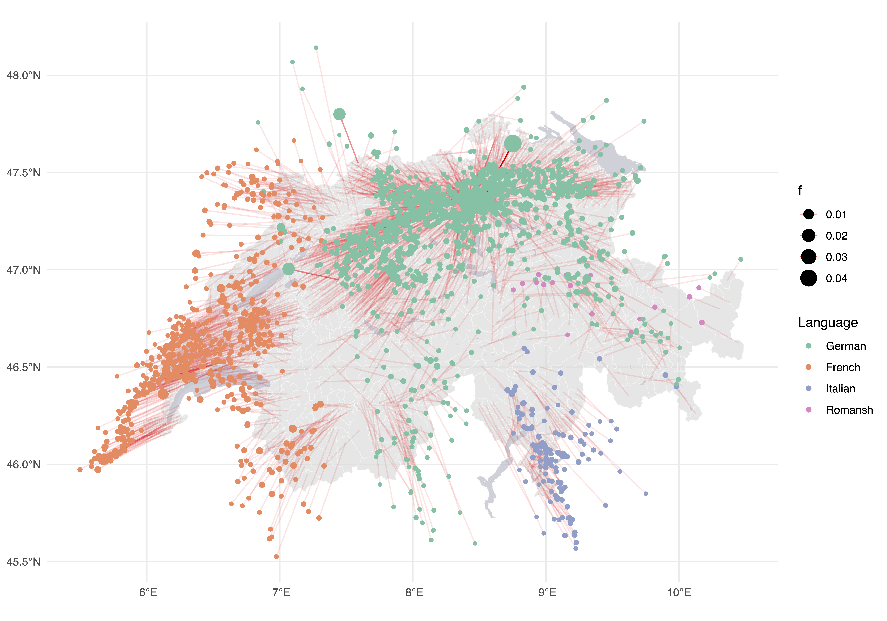

# Déformer la carte de la Suisse selon les distances politiques 🇨🇭
Cette contribution propose une méthode simple pour visualiser l'effet des distances politiques entre communes suisses dans le but de cartographier le résultat. En se basant sur les coordonnées géographiques du centre des communes et d'une matrice de dissimilarité politique issue des votations fédérales, nous ajustons ces coordonnées avec un algorithme itératif de type ressorts. Il est alors possible de produire une carte où les proximités politiques se traduisent par des rapprochements spatiaux, tandis que les oppositions se traduisent par des éloignements, tout en conservant un lien avec l'emplacement initial de la commune.

## Données 📁

Les données utilisées pour cet algorithme ainsi que les calculs de distances sont les suivantes:

### Coordonnées géographiques 🌍

Nous utilisons les centres économiques des $n =2126$ communes suisses de 2024, qui définissent les positions initiales $(x_i^0,y_i^0)$ qui sont les coordonnées géographique WGS84.

### Distances politiques 💼

Nous disposons d'une matrice euclidienne carrée $\mathbf{D}\_{\text{pol}} = (d^{\text{pol}}\_{ij})$ de dissimilarité politique, calculée à partir des résultats des 381 votations fédérales. Cette matrice est symétrique, non négative et de diagonale nulle. La valeur $d^{\text{pol}}_{ij}$ exprime à quel point les communes $i$ et $j$ diffèrent dans leurs comportements de vote. Cette matrice est ici normalisée entre 0 et 1 afin d'être comparable aux distances géographiques et de permettre un choix plus aisé des paramètres.

### Algorithme 💻

Soit $X = (x_i,y_i)_{i=1}^n$ les coordonnées spatiales de départ.

Avant le début des itérations, on calcule la moyenne des dissimilarités politiques :

$\overline{d^{\text{pol}}}
  = \frac{1}{n(n-1)/2}
  \sum_{i<j} d^{\text{pol}}_{ij}.$

Cette valeur représente le niveau moyen de divergence politique entre les communes de façon non pondérée. Ce choix a été fait afin donner le même poids à chaque commune et d'analyser uniquement le comportement politique par rapport au voisinage sans que les grandes villes ne prennent l'avantage sur les petites communes.
Elle sert de seuil d’équilibre pour les ressorts : 
les paires de communes plus proches que cette moyenne s’attirent,
tandis que celles plus éloignées se repoussent.

À chaque itération, pour chaque $i$ :
* On calcule les distances géographiques courantes $d_{ij}$.
* On définit une force politique proportionnelle à $F_{ij} = k_{\text{spring}} \cdot (d^\text{pol}\_{ij} - \overline{d^\text{pol}})$, appliquée dans la direction $(x_j - x_i, y_j - y_i)/d_{ij}$ A noter que ${F}\_{ij}=-{F}_{ji}$.
  
* On somme ces contributions sur toutes les autres communes $j$, ce qui donne un déplacement $\Delta_i$. i.e. $\Delta_i = \sum_{j,j\ne i} {F}_{ij}$.
* On ajoute à la position initiale un terme d'ancrage $k_{\text{init}} \cdot (x_i^0-x_i, y_i^0-y_i)$, proportionnel au carré de la distance.
* On met à jour $x_i \leftarrow x_i + \Delta_i$. La position initiale est alors modifiée et les coordonnées géographiques mises à jour.

Après un nombre fini d'itérations (ici 50), le système converge vers une configuration stable où l'équilibre entre les forces est atteint.

### Résultats 📈
<figure>
    
</figure>
